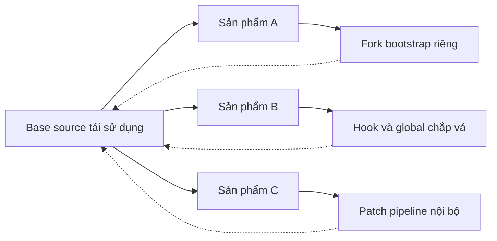
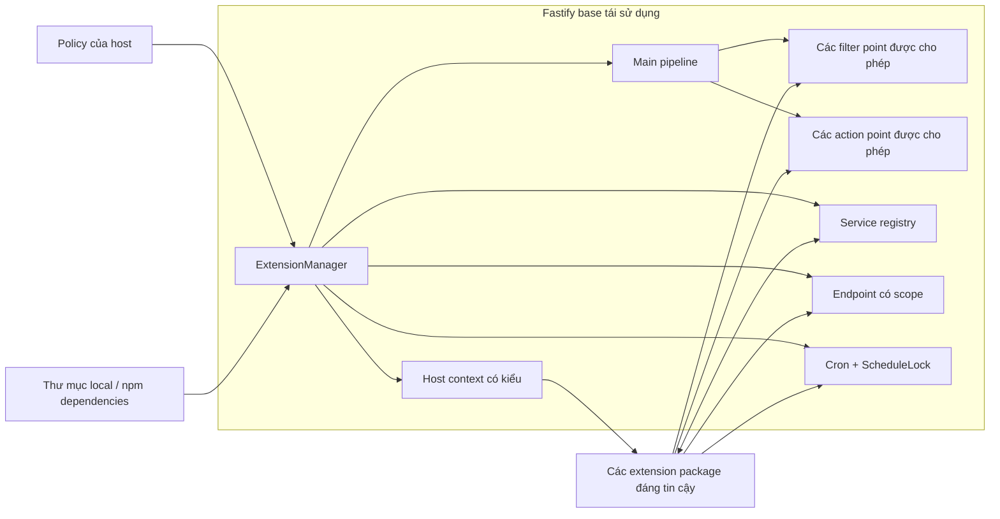
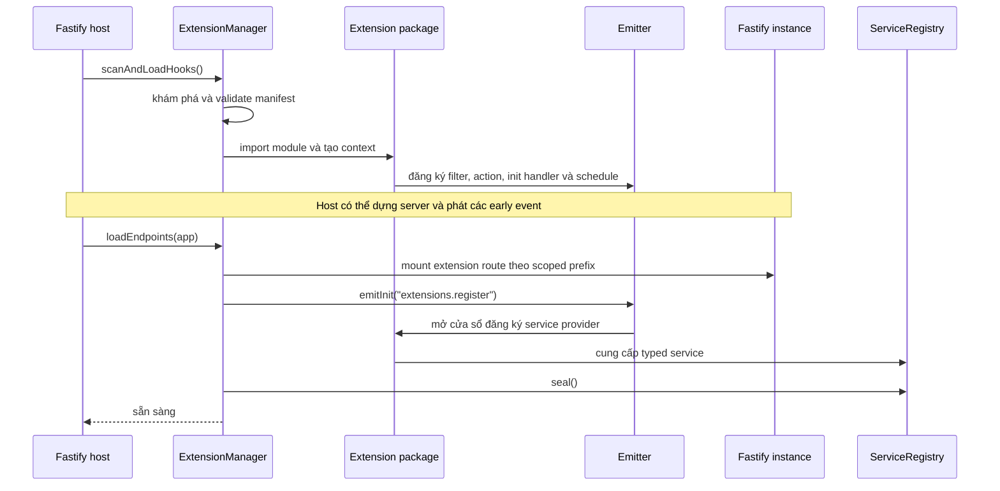
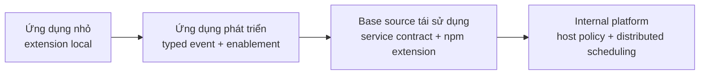

# Giữ core ổn định. Để mọi sản phẩm tự do mở rộng.

> Extension runtime có kiểm soát dành cho những nền tảng Fastify có khả năng tái sử dụng.

Bạn xây một ứng dụng nền tảng duy nhất. Sản phẩm đầu tiên phù hợp với nó một cách hoàn hảo.

Sản phẩm thứ hai cần một chính sách riêng. Sản phẩm thứ ba cần thêm một phương thức xác
thực. Khách hàng này muốn có audit log; khách hàng khác lại cần một tích hợp nội bộ. Một ứng
dụng nhỏ tưởng như đã hoàn thiện sáu tháng trước bỗng cần những hành vi chưa từng được dự
kiến.

Khi đó, các đội ngũ thường phải chọn một trong ba phương án không mấy tốt đẹp:

- sửa pipeline nền tảng cho đến khi mỗi dự án đều mang theo một tập hợp ngoại lệ riêng;
- fork source và dần đánh mất khả năng nâng cấp;
- thêm các hook dùng một lần, global, dynamic import và cron job cho đến khi cơ chế extension
  tồn tại ở khắp nơi nhưng lại không được định nghĩa rõ ràng ở đâu cả.

Vấn đề không nằm ở việc Fastify thiếu plugin. Vấn đề là làm sao giữ một core có thể tái sử
dụng **mở cho việc mở rộng nhưng không mở main pipeline cho việc sửa đổi**.

`@codihaus/fastify-extensions` cung cấp cho Fastify base source những điểm mở rộng có chủ
đích và do host kiểm soát. Các sản phẩm downstream có thể bổ sung policy, integration,
route, observer, service và scheduled task mà không cần tiếp quản core bootstrap.

Host vẫn kiểm soát:

- extension được phép đến từ đâu;
- extension nào được bật hoặc bắt buộc phải có;
- extension được nhận context và service nào;
- extension được quan sát hoặc biến đổi pipeline ở đâu;
- endpoint, provider và schedule được đăng ký khi nào;
- failure và cleanup được xử lý ra sao.

Extension cung cấp hành vi. Base source giữ quyền đặt ra luật chơi.

## Vì sao một extension kernel dùng chung lại quan trọng

Từng thành phần riêng lẻ trông có vẻ rất nhỏ: quét một thư mục, dynamic import một module,
tạo event emitter, thêm service map, khởi chạy cron job. Tự làm lại chúng trong mỗi base
source là chuyện dễ. Nhưng xây chúng với một lifecycle thống nhất, một failure model rõ ràng,
cleanup, typing, enablement và boot order có thể dự đoán thì không hề đơn giản.

Khi không có một ranh giới chung, khả năng tái sử dụng cuối cùng sẽ biến thành sự phân mảnh:



Các đường nét đứt quay ngược về base chính là chi phí của việc tái sử dụng mà không có ranh
giới: xung đột khi nâng cấp, convention ngày càng khác nhau và mất khả năng tuân thủ.

Một ranh giới extension có kiểm soát sẽ giữ dependency đi đúng hướng:



Base không cần dự đoán mọi tính năng có thể xuất hiện trong tương lai. Nó chỉ cần định nghĩa
những vị trí mà hành vi tương lai được phép kết nối vào.

## Đây là gì — và không phải là gì

Đây không phải CMS, marketplace hay công cụ thay thế plugin system của Fastify. Nó là lớp ở
cấp ứng dụng nằm trên Fastify plugin: một server-side extension kernel nhỏ để khám phá, bật,
boot, kết nối và cleanup các feature package đáng tin cậy.

| Pain point của source tái sử dụng | Khả năng được kiểm soát | Kết quả |
|---|---|---|
| Mỗi tính năng downstream đều sửa bootstrap | Manifest discovery từ thư mục local và npm dependency | Hành vi mới nằm ngoài base source |
| Các dự án fork pipeline để bổ sung policy | Các filter point và action point có tên rõ ràng | Host quyết định chính xác hành vi được can thiệp ở đâu |
| Module tùy chỉnh truy cập thẳng vào host global | Generic `TContext` injection | Base công bố một contract có chủ đích |
| Module tùy chọn trở thành compile-time dependency | Enablement bất đồng bộ và kiểm tra extension bắt buộc | Cùng một base có thể phục vụ nhiều tổ hợp sản phẩm |
| Các extension import lẫn nhau | Typed service registry | Provider và consumer chia sẻ contract thay vì phụ thuộc implementation |
| Hook chạy sớm và route chạy muộn cần thời điểm khác nhau | Two-phase loading | Observer của pipeline tồn tại trước khi endpoint được mount |
| Background task chạy trên mọi replica | `ScheduleLock` có thể thay thế | Host có thể điều phối cron tick qua Redis hoặc database |
| Mỗi dự án tự nghĩ ra cách cleanup | Các async cleanup function được ghi nhận | Hành vi phía hook tuân theo cùng một lifecycle |

## Lifecycle chính là tính năng cốt lõi

Một extension system không chỉ là quét thư mục. Phần khó nhất là quyết định **khi nào** mỗi
loại extension code được phép chạy.

`@codihaus/fastify-extensions` làm thứ tự đó trở nên rõ ràng:



Đây là lý do hook và endpoint được load riêng:

- **Phase 1** không cần Fastify router. Extension đăng ký host event và schedule.
- **Phase 2** nhận Fastify instance thật. Endpoint được mount, provider đăng ký service và
  registry được seal.

Mỗi phase chỉ chạy một lần trong một load cycle. Hãy chạy chúng tuần tự khi boot; gọi
`reset()` trước khi bắt đầu một cycle mới.

## Bắt đầu nhỏ mà không cần đoán trước tương lai

Sử dụng extension boundary không có nghĩa là biến một ứng dụng nhỏ thành platform ngay từ
ngày đầu tiên. Package có thể được áp dụng theo từng bước:



Với ứng dụng nhỏ, hãy bắt đầu bằng một thư mục `extensions/` local, một typed context và một
vài semantic hook. Đặt `moduleRoot: false`. Chưa cần thêm registry, distributed lock hay
package discovery cho đến khi ứng dụng thật sự cần chúng.

Giá trị không nằm ở việc dự đoán tính năng tương lai. Giá trị nằm ở việc quyết định từ sớm,
với chi phí thấp, cách một tính năng chưa biết trước sẽ kết nối vào mà không phải viết lại
core.

Vì cùng một extension contract có thể được tái sử dụng qua nhiều base source, đội ngũ chỉ
cần học một mental model thay vì phải tiếp quản một tập hợp dynamic import, event bus,
global và startup convention khác nhau trong mỗi dự án.

## Giữ invariant trong core; đặt phần biến đổi ở rìa

Extension system trở nên nguy hiểm khi mọi function đều có hook. Mục tiêu không phải biến
pipeline thành một thứ tùy ý. Mục tiêu là công bố một số ít ranh giới thật sự có ý nghĩa.

| Nên giữ trong reusable core | Ứng viên phù hợp làm extension |
|---|---|
| Domain invariant luôn phải đúng | Policy riêng theo khách hàng hoặc sản phẩm |
| Ranh giới transaction và persistence | Notification, audit và analytics |
| Bảo đảm an ninh host bắt buộc phải thực thi | Phương thức xác thực tùy chọn |
| State transition chuẩn | External integration và adapter |
| Failure behavior cần thiết cho tính đúng đắn | Endpoint và scheduled task bổ sung |

Một nguyên tắc hữu ích:

> Core sở hữu những gì bắt buộc phải đúng. Extension sở hữu những gì có thể thay đổi, được
> thay thế hoặc không tồn tại.

Điều này giữ lại ý tưởng mạnh nhất của các hệ thống dựa trên hook, đồng thời tránh “hook
soup”: thứ tự ngầm, event string nằm khắp nơi và một pipeline không ai còn có thể suy luận.

## Tuân thủ kiến trúc, không phải security sandbox

Manager trao cho base source quyền quản trị việc tích hợp extension: manifest validation,
enablement, required id, context injection, lifecycle phase, service registration và cleanup
đều đi qua contract do host sở hữu.

Đó là khả năng tuân thủ kiến trúc dành cho những đội ngũ đáng tin cậy. Nó không phải cơ chế
ngăn chặn hostile code. Extension là một Node.js module bình thường và có cùng quyền truy cập
filesystem, network, environment và process như host. Nếu extension cần được cô lập theo mô
hình đối kháng, hãy chạy nó qua ranh giới worker, process, container hoặc service.

## Cài đặt

```bash
npm install @codihaus/fastify-extensions
```

`fastify` là optional peer dependency. Hãy cài Fastify khi sử dụng endpoint extension hoặc
plugin wrapper. Host chỉ dùng hook, emitter và scheduling không cần Fastify ở runtime.

## Bắt đầu với two-phase manager

Sử dụng manager trực tiếp khi extension cần quan sát event trước khi toàn bộ host route và
plugin được dựng xong.

```ts
import Fastify, { type FastifyBaseLogger } from 'fastify';
import { ExtensionManager } from '@codihaus/fastify-extensions';

interface AppContext {
  extensionId: string;
  log: FastifyBaseLogger;
}

const app = Fastify({ logger: true });

const extensions = new ExtensionManager<AppContext>({
  manifestKey: 'acme-extension',
  extensionsPath: './extensions',

  // Đặt false nếu host không cần quét các npm dependency.
  moduleRoot: process.cwd(),

  createContext: (config) => ({
    extensionId: config.id,
    log: app.log.child({ extension: config.id }),
  }),
});

// Phase 1: các extension hook đã hoạt động.
await extensions.scanAndLoadHooks();

// Dựng phần của host. Extension đã có thể quan sát event được phát tại đây.
app.get('/health', async () => ({ ok: true }));

// Phase 2: mount extension endpoint và seal service registry.
await extensions.loadEndpoints(app);

await app.listen({ port: 3000 });
```

Cùng một context instance được truyền qua cả hai phase. `createContext` chạy một lần cho mỗi
extension đi đến bước loading.

## Hoặc sử dụng one-phase Fastify plugin

Sử dụng wrapper khi bạn không cần phát host event trong khoảng giữa hai phase.

```ts
import Fastify from 'fastify';
import {
  fastifyExtensions,
  type ExtensionManager,
} from '@codihaus/fastify-extensions';

interface AppContext {
  extensionId: string;
}

const app = Fastify();
let extensions: ExtensionManager<AppContext> | undefined;

await app.register(fastifyExtensions, {
  manifestKey: 'acme-extension',
  extensionsPath: './extensions',
  createContext: (config) => ({ extensionId: config.id }),
  onManager: (manager) => {
    extensions = manager;
  },
});

console.log(extensions?.getExtensions());
await app.listen({ port: 3000 });
```

Wrapper chủ động giữ nguyên cơ chế encapsulation của Fastify:

- `app.register(fastifyExtensions, options)` mount route và decorator `extensions` bên trong
  registration scope đó. Dùng `onManager` để giữ manager handle ở bên ngoài scope.
- `await fastifyExtensions(app, options)` chạy trực tiếp trên chính instance được truyền vào,
  vì vậy route được mount ở root và `app.extensions` khả dụng tại đó.

## Extension chỉ là một package có manifest

Extension có thể nằm trong thư mục local đã cấu hình hoặc được cài dưới dạng dependency của
host.

```jsonc
{
  "name": "@acme/order-policy",
  "type": "module",
  "main": "dist/index.js",
  "acme-extension": {
    "id": "order-policy"
  }
}
```

Manifest key do host lựa chọn. Không có default toàn cục, nhờ đó các hệ sinh thái extension
không liên quan sẽ không vô tình khám phá package của nhau.

### Hook extension

```ts
import { defineHook } from '@codihaus/fastify-extensions/types';
import type { AppContext, RequestContext } from '@acme/api-types';

export default defineHook<AppContext, RequestContext>(async (hook, context) => {
  hook.filter<{ total: number }>('orders.create', async (order) => {
    if (order.total <= 0) {
      throw new Error('Order total must be positive');
    }

    return { ...order, validatedBy: context.extensionId };
  });

  hook.action('orders.created', async (meta, requestContext) => {
    context.log.info({ orderId: meta.orderId }, 'order created');
  });

  hook.schedule('*/5 * * * *', async () => {
    context.log.info({}, 'scheduled reconciliation');
  });
});
```

Các event tier chủ động có hành vi khác nhau:

| Tier | Cách thực thi | Emitter có chờ không | Khi handler lỗi |
|---|---|---:|---|
| Filter | Tuần tự; output của handler trước đi vào handler sau | Có | Lỗi được propagate và pipeline dừng lại |
| Action | Fire-and-forget; các handler phù hợp khởi chạy độc lập | Không | Được bắt và ghi log riêng theo handler |
| Init | Khởi tạo tuần tự | Có | Lỗi được propagate và init emission thất bại |

Subscription hỗ trợ tên chính xác, `*`, prefix pattern như `orders.*` và suffix pattern theo
ranh giới dấu chấm như `*.created`.

### Endpoint extension

Đánh dấu package có một default export là endpoint:

```jsonc
{
  "name": "@acme/order-tools",
  "main": "dist/index.js",
  "acme-extension": {
    "id": "order-tools",
    "type": "endpoint"
  }
}
```

```ts
import { defineEndpoint } from '@codihaus/fastify-extensions/types';
import type { AppContext } from '@acme/api-types';

export default defineEndpoint<AppContext>(async (router, context) => {
  router.get('/status', async () => ({
    ok: true,
    extension: context.extensionId,
  }));
});
```

Với id `order-tools`, route được mount dưới `/order-tools`, tạo thành
`GET /order-tools/status`.

Một extension cũng có thể là bundle với các named export `hooks`, `endpoints` và
`endpoint_<name>`. Xem [README API đầy đủ](./README.md) để biết quy tắc bundle và toàn bộ
manifest reference.

## Chia sẻ service mà không coupling hai extension

Provider và consumer import cùng một typed reference từ một contract package nhỏ:

```ts
// @acme/contracts/analytics.ts
import { createServiceRef } from '@codihaus/fastify-extensions/types';

export interface AnalyticsService {
  record(name: string): Promise<void>;
}

export const analyticsRef =
  createServiceRef<AnalyticsService>('acme.analytics');
```

Provider đăng ký trong init window được kiểm soát:

```ts
hook.init('extensions.register', async () => {
  context.registry.provide(analyticsRef, context.analytics);
});
```

Consumer resolve service sau khi loading hoàn tất, thông thường bên trong request hoặc event
handler:

```ts
const analytics = context.registry.consume(analyticsRef);
await analytics.record('order.created');
```

Consumer phụ thuộc vào contract, không phụ thuộc provider package. Thay thế provider không
yêu cầu thay đổi consumer.

## Extension local và extension đã cài đặt có thể cùng tồn tại

Khi extension local và dependency đã cài đặt dùng cùng một id, extension local được ưu tiên.
Điều này giúp việc phát triển local và override riêng theo host trở nên đơn giản.

Chỉ các package trong `dependencies` được quét, không bao giờ quét `devDependencies`. Đặt
`moduleRoot: false` để tắt hoàn toàn npm-dependency discovery.

## Khai báo rõ extension quan trọng

Module tùy chọn không nên ngăn ứng dụng boot. Module quan trọng thì nên làm điều đó.

```ts
const extensions = new ExtensionManager({
  manifestKey: 'acme-extension',
  extensionsPath: './extensions',
  mustLoad: ['authentication', 'tenant-policy'],
  isEnabled: async (id) => featureFlags.isEnabled(id),
  createContext,
});
```

Lỗi import hoặc đăng ký hook được cô lập theo từng extension. Sau Phase 1, nếu id trong
`mustLoad` không có mặt trong pending set, startup sẽ thất bại rõ ràng.

`mustLoad` là bảo đảm của Phase 1. Nó không khẳng định mọi endpoint trong Phase 2 đều được
mount thành công.

## Schedule trong một process và nhiều process

`MemoryScheduleLock` mặc định phù hợp với một host instance đang chạy. Trong deployment có
nhiều replica, hãy truyền vào một lock dùng Redis hoặc database:

```ts
const extensions = new ExtensionManager({
  // ...
  scheduleLock: redisScheduleLock,
});
```

Với mỗi tick, scheduler gọi:

```ts
claim(name, timestamp): Promise<boolean>
```

Chỉ instance nhận được `true` mới chạy handler. Package cung cấp scheduling contract; host
cung cấp cơ chế điều phối phù hợp với hạ tầng.

## Khi nào nên sử dụng

Package này phù hợp khi:

- bạn duy trì Fastify base source có khả năng tái sử dụng qua nhiều sản phẩm;
- dự án downstream cần tùy chỉnh mà không fork main pipeline;
- bạn đang xây internal platform, modular SaaS API hoặc headless backend foundation;
- feature package cần hook, endpoint, schedule hoặc shared service;
- host cần giữ quyền kiểm soát enablement, required module, context và lifecycle;
- extension local và package đã cài đặt cần dùng cùng một contract;
- extension author cần nhận typed context do host sở hữu;
- extension là trusted code do tổ chức của bạn hoặc đối tác đáng tin cậy duy trì.

## Khi nào không nên sử dụng

Hãy chọn một công cụ nhỏ hơn hoặc có khả năng cô lập tốt hơn khi:

- bạn chỉ cần load các file route từ một thư mục — `@fastify/autoload` có lẽ đã đủ;
- extension là third-party code không đáng tin cậy — package này không cung cấp ranh giới VM,
  worker, process, permission hoặc secret;
- bạn cần cài npm package trong runtime;
- bạn cần hot reload bằng file watcher;
- bạn cần gỡ Fastify route mà không restart process;
- bạn cần hỗ trợ frontend extension hoặc plugin marketplace.

## Ranh giới vận hành

Các giới hạn sau là chủ đích thiết kế:

- Extension chạy với cùng quyền truy cập filesystem, network, environment và process như
  host.
- Fastify route không thể được unregister. Unload sẽ loại bỏ đăng ký phía hook, init, action
  và schedule; route đã mount vẫn tồn tại cho đến khi process restart.
- ESM module vẫn nằm trong module cache của Node.js.
- Action handler là fire-and-forget; emitter không chờ chúng trước khi trả về.
- Mỗi manager load cycle chạy tuần tự và chỉ một lần. Gọi `reset()` trước khi bắt đầu cycle
  khác.
- Schedule lock mặc định chỉ dành cho single-instance.

Đây không phải các implementation detail bị che giấu. Chúng xác định loại hệ thống mà package
này có thể phục vụ an toàn và hiệu quả: **hệ sinh thái server-side extension đáng tin cậy với
startup được kiểm soát**.

## Tổng quan public surface

```ts
import {
  ExtensionManager,
  Emitter,
  ServiceRegistryImpl,
  MemoryScheduleLock,
  fastifyExtensions,
  createServiceRef,
  defineHook,
  defineEndpoint,
} from '@codihaus/fastify-extensions';
```

Extension package nên import authoring helper và type từ loader-free subpath:

```ts
import {
  defineHook,
  defineEndpoint,
  createServiceRef,
} from '@codihaus/fastify-extensions/types';
```

Để xem toàn bộ option, manifest field, quy tắc bundle export, registry semantic, wildcard
rule và giới hạn, hãy đọc tiếp [README API đầy đủ](./README.md).

---

**Tóm lại:** Fastify đã có một plugin system rất tốt. Package này bổ sung ranh giới ứng dụng
có kiểm soát nằm phía trên: sản phẩm downstream được phép mở rộng base, trong khi base vẫn
sở hữu contract, lifecycle và main pipeline của mình.
