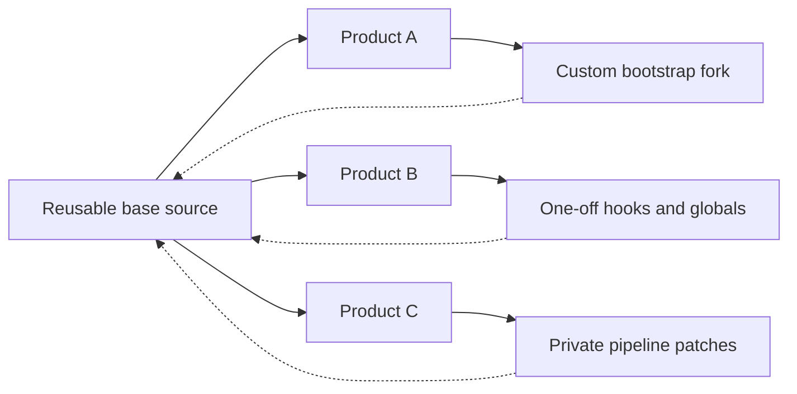
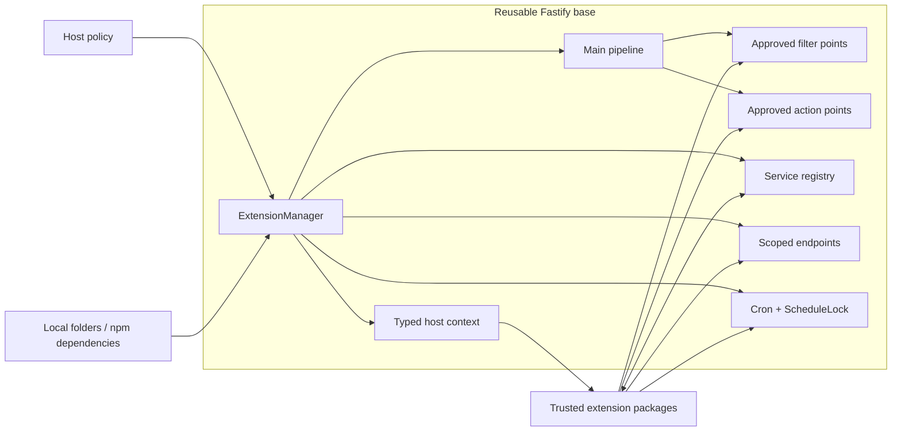
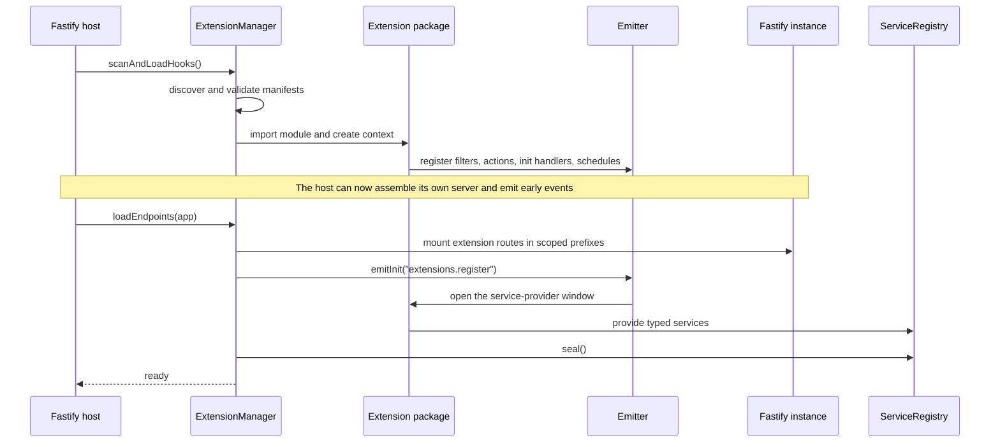
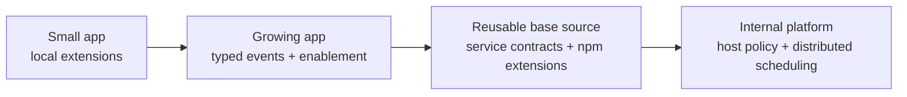

# Keep the core stable. Let every product extend it.

> A controlled extension runtime for reusable Fastify foundations.

[Tiếng Việt](./README-vi.md)

You build a base application once. The first product fits it perfectly.

The second product needs a custom policy. The third needs another authentication method.
One customer wants audit logging; another needs a private integration. A small application
that looked finished six months ago suddenly needs behavior nobody planned for.

At that point, teams usually choose one of three bad options:

- edit the base pipeline until every project carries its own exceptions;
- fork the source and slowly lose the ability to upgrade;
- add one-off hooks, globals, dynamic imports, and cron jobs until extension behavior exists
  everywhere but is defined nowhere.

The problem is not that Fastify lacks plugins. The problem is keeping a reusable core
**open for extension without making its main pipeline open for modification**.

`@codihaus/fastify-extensions` gives a Fastify base source intentional, host-controlled
extension points. Downstream products can add policies, integrations, routes, observers,
services, and scheduled work without taking ownership of the core bootstrap.

The host keeps control of:

- where extensions may come from;
- which extensions are enabled or required;
- what context and services they are allowed to receive;
- where they may observe or transform the pipeline;
- when endpoints, providers, and schedules are registered;
- how failures and cleanup are handled.

Extensions provide behavior. The base source keeps the rules.

## Why a shared extension kernel matters

The individual pieces look deceptively small: scan a folder, dynamically import a module,
create an event emitter, add a service map, start a cron job. Rebuilding them inside every
base source is easy. Rebuilding them with one lifecycle, one failure model, cleanup,
typing, enablement, and predictable boot order is not.

Without a shared boundary, reuse eventually turns into drift:



The dotted return paths are the cost of reuse without boundaries: upgrade conflicts,
diverging conventions, and lost compliance.

A controlled extension boundary keeps the dependency direction intact:



The base does not need to predict every future feature. It only defines the places where
future behavior may connect.

## What this is — and what it is not

This is not a CMS, a marketplace, or a replacement for Fastify's plugin system. It is the
application-level layer above Fastify plugins: a small server-side extension kernel for
discovering, enabling, booting, connecting, and cleaning up trusted feature packages.

| Reusable-source pain point | Controlled capability | Outcome |
|---|---|---|
| Every downstream feature edits the bootstrap | Manifest discovery from local folders and npm dependencies | New behavior stays outside the base source |
| Projects fork the pipeline to add policy | Named filter and action points | The host decides exactly where behavior may intervene |
| Custom modules reach into host globals | Generic `TContext` injection | The base publishes an intentional contract |
| Optional modules become compile-time dependencies | Async enablement and required-extension checks | The same base can support different product compositions |
| Extensions import each other | Typed service registry | Providers and consumers share contracts instead of implementation dependencies |
| Early hooks and late routes need different timing | Two-phase loading | Pipeline observers exist before endpoint mounting |
| Background work runs on every replica | Pluggable `ScheduleLock` | The host can coordinate cron ticks through Redis or a database |
| Every project invents cleanup differently | Recorded async cleanup functions | Hook-side behavior follows one lifecycle |

## The lifecycle is the feature

An extension system is not just a directory scan. The difficult part is deciding **when**
each kind of extension code is allowed to run.

`@codihaus/fastify-extensions` makes that order explicit:



This is why hooks and endpoints are loaded separately:

- **Phase 1** needs no Fastify router. Extensions subscribe to host events and schedules.
- **Phase 2** receives the real Fastify instance. Endpoints mount, providers register their
  services, and the registry seals.

Each phase is one-shot per load cycle. Run them serially during boot; call `reset()` before
starting a fresh cycle.

## Start small without predicting the future

Using an extension boundary does not mean turning a small application into a platform on
day one. The package can be adopted progressively:



For a small app, start with one local `extensions/` directory, a typed context, and a few
semantic hooks. Set `moduleRoot: false`. Do not add a registry, distributed lock, or package
discovery until the application needs them.

The value is not predicting future features. The value is deciding, early and cheaply, how
an unknown future feature will attach without rewriting the core.

Because the same extension contract can be reused across base sources, teams learn one
mental model instead of inheriting a different collection of dynamic imports, event buses,
globals, and startup conventions in every project.

## Keep invariants in core; put variation at the edge

An extension system becomes dangerous when every function gets a hook. The goal is not to
make the pipeline arbitrary. The goal is to expose a small number of meaningful boundaries.

| Keep in the reusable core | Good extension candidates |
|---|---|
| Domain invariants that must always hold | Customer- or product-specific policy |
| Transaction and persistence boundaries | Notifications, audit, and analytics |
| Security guarantees the host must enforce | Optional authentication methods |
| Canonical state transitions | External integrations and adapters |
| Failure behavior required for correctness | Additional endpoints and scheduled work |

A useful rule:

> Core owns what must be correct. Extensions own what may vary, be replaced, or not exist.

This preserves the strongest idea behind hook-driven systems while avoiding “hook soup”:
implicit ordering, string events everywhere, and a pipeline nobody can reason about.

## Architectural compliance, not a security sandbox

The manager gives a base source governance over extension integration: manifest validation,
enablement, required ids, context injection, lifecycle phases, service registration, and
cleanup all pass through host-owned contracts.

That is architectural compliance for trusted teams. It is not containment for hostile code.
An extension is a normal Node.js module and has the same filesystem, network, environment,
and process access as the host. If extensions must be adversarially isolated, run them across
a worker, process, container, or service boundary instead.

## Install

```bash
npm install @codihaus/fastify-extensions
```

`fastify` is an optional peer dependency. Install Fastify when you use endpoint extensions
or the plugin wrapper. Hook-, emitter-, and scheduling-only hosts do not need its runtime.

## Runnable feature lab

The [consumer app](./examples/consumer-app) installs the published npm package and exercises
discovery, host enablement, required extensions, two-phase loading, filters, actions, bundles,
the service registry, schedules, and cleanup:

```bash
cd examples/consumer-app
npm install
npm test
npm start
```

## Agent guides

The npm package ships with two integration guides:

- [AGENTS.md](./AGENTS.md) is the canonical contract for agent-assisted integration and
  extension authoring.
- [CLAUDE.md](./CLAUDE.md) gives Claude a shorter execution guide with lifecycle invariants,
  diagnostics, and validation checklists.

## Start with the two-phase manager

Use the manager directly when extensions must observe events before all host routes and
plugins have been assembled.

```ts
import Fastify, { type FastifyBaseLogger } from 'fastify';
import { ExtensionManager } from '@codihaus/fastify-extensions';

interface AppContext {
  extensionId: string;
  log: FastifyBaseLogger;
}

const app = Fastify({ logger: true });

const extensions = new ExtensionManager<AppContext>({
  manifestKey: 'acme-extension',
  extensionsPath: './extensions',

  // Set false when the host should not scan its npm dependencies.
  moduleRoot: process.cwd(),

  createContext: (config) => ({
    extensionId: config.id,
    log: app.log.child({ extension: config.id }),
  }),
});

// Phase 1: extension hooks are active.
await extensions.scanAndLoadHooks();

// Build the host itself. Extensions can already observe events emitted here.
app.get('/health', async () => ({ ok: true }));

// Phase 2: mount extension endpoints and seal the service registry.
await extensions.loadEndpoints(app);

await app.listen({ port: 3000 });
```

The same context instance is passed to both phases. `createContext` runs once for each
extension that reaches loading.

## Or use the one-phase Fastify plugin

Use the wrapper when you do not need to emit host events between the two phases.

```ts
import Fastify from 'fastify';
import {
  fastifyExtensions,
  type ExtensionManager,
} from '@codihaus/fastify-extensions';

interface AppContext {
  extensionId: string;
}

const app = Fastify();
let extensions: ExtensionManager<AppContext> | undefined;

await app.register(fastifyExtensions, {
  manifestKey: 'acme-extension',
  extensionsPath: './extensions',
  createContext: (config) => ({ extensionId: config.id }),
  onManager: (manager) => {
    extensions = manager;
  },
});

console.log(extensions?.getExtensions());
await app.listen({ port: 3000 });
```

The wrapper deliberately keeps Fastify encapsulation:

- `app.register(fastifyExtensions, options)` mounts routes and the `extensions` decorator
  inside that registration scope. Use `onManager` to keep a handle outside the scope.
- `await fastifyExtensions(app, options)` runs directly on the exact instance passed, so
  routes mount at the root and `app.extensions` is available there.

## An extension is just a package with a manifest

An extension can live in the configured local directory or be installed as a dependency of
the host.

```jsonc
{
  "name": "@acme/order-policy",
  "type": "module",
  "main": "dist/index.js",
  "acme-extension": {
    "id": "order-policy"
  }
}
```

The manifest key is chosen by the host. There is no global default, so unrelated extension
ecosystems do not accidentally discover each other's packages.

### Hook extension

```ts
import { defineHook } from '@codihaus/fastify-extensions/types';
import type { AppContext, RequestContext } from '@acme/api-types';

export default defineHook<AppContext, RequestContext>(async (hook, context) => {
  hook.filter<{ total: number }>('orders.create', async (order) => {
    if (order.total <= 0) {
      throw new Error('Order total must be positive');
    }

    return { ...order, validatedBy: context.extensionId };
  });

  hook.action('orders.created', async (meta, requestContext) => {
    context.log.info({ orderId: meta.orderId }, 'order created');
  });

  hook.schedule('*/5 * * * *', async () => {
    context.log.info({}, 'scheduled reconciliation');
  });
});
```

The event tiers intentionally behave differently:

| Tier | Execution | Awaited by emitter | Handler error |
|---|---|---:|---|
| Filter | Sequential; output flows into the next handler | Yes | Propagates and stops the pipeline |
| Action | Fire-and-forget; matching handlers start independently | No | Caught and logged per handler |
| Init | Sequential initialization | Yes | Propagates and fails the init emission |

Subscriptions support exact names, `*`, prefix patterns such as `orders.*`, and
dot-bounded suffix patterns such as `*.created`.

### Endpoint extension

Mark a single-default-export package as an endpoint:

```jsonc
{
  "name": "@acme/order-tools",
  "main": "dist/index.js",
  "acme-extension": {
    "id": "order-tools",
    "type": "endpoint"
  }
}
```

```ts
import { defineEndpoint } from '@codihaus/fastify-extensions/types';
import type { AppContext } from '@acme/api-types';

export default defineEndpoint<AppContext>(async (router, context) => {
  router.get('/status', async () => ({
    ok: true,
    extension: context.extensionId,
  }));
});
```

With id `order-tools`, the route is mounted under `/order-tools`, producing
`GET /order-tools/status`.

An extension may also be a bundle with named `hooks`, `endpoints`, and
`endpoint_<name>` exports. See [the public type contracts](./src/types.ts) and the test suite
for executable examples of supported module shapes.

## Share a service without coupling two extensions

Provider and consumer import the same typed reference from a small contract package:

```ts
// @acme/contracts/analytics.ts
import { createServiceRef } from '@codihaus/fastify-extensions/types';

export interface AnalyticsService {
  record(name: string): Promise<void>;
}

export const analyticsRef =
  createServiceRef<AnalyticsService>('acme.analytics');
```

The provider registers during the controlled init window:

```ts
hook.init('extensions.register', async () => {
  context.registry.provide(analyticsRef, context.analytics);
});
```

Consumers resolve the service after loading has completed, typically inside a request or
event handler:

```ts
const analytics = context.registry.consume(analyticsRef);
await analytics.record('order.created');
```

The consumer depends on the contract, not the provider package. Replacing the provider does
not require changing the consumer.

## Local extensions and installed extensions can coexist

When a local extension and an installed dependency use the same id, the local extension
wins. This makes local development and host-specific overrides straightforward.

Only `dependencies` are scanned, never `devDependencies`. Set `moduleRoot: false` to disable
npm-dependency discovery entirely.

## Make critical extensions explicit

Optional modules should not prevent boot. Critical modules should.

```ts
const extensions = new ExtensionManager({
  manifestKey: 'acme-extension',
  extensionsPath: './extensions',
  mustLoad: ['authentication', 'tenant-policy'],
  isEnabled: async (id) => featureFlags.isEnabled(id),
  createContext,
});
```

Import or hook-registration failures are isolated per extension. After Phase 1, any id in
`mustLoad` that did not reach the pending set makes startup fail loudly.

`mustLoad` is a Phase-1 guarantee. It does not assert that every endpoint in Phase 2 mounted
successfully.

## Schedules in one process and many

The default `MemoryScheduleLock` is correct for one running host instance. In a replicated
deployment, pass a lock backed by Redis or a database:

```ts
const extensions = new ExtensionManager({
  // ...
  scheduleLock: redisScheduleLock,
});
```

For each tick, the scheduler calls:

```ts
claim(name, timestamp): Promise<boolean>
```

Only the instance that receives `true` runs the handler. The package supplies the scheduling
contract; the host supplies infrastructure-specific coordination.

## Use this when

This package is a good fit when:

- you maintain reusable Fastify base sources across multiple products;
- downstream projects need customization without forking the main pipeline;
- you are building an internal platform, modular SaaS API, or headless backend foundation;
- feature packages need hooks, endpoints, schedules, or shared services;
- the host must retain control over enablement, required modules, context, and lifecycle;
- local extensions and installed packages should use the same contract;
- extension authors should receive a typed, host-owned context;
- extensions are trusted code maintained by your organization or partners you trust.

## Do not use this when

Choose a smaller or more isolated tool when:

- you only want to load route files from one directory — `@fastify/autoload` is likely
  enough;
- extensions are untrusted third-party code — this package does not provide a VM, worker,
  process, permission, or secret boundary;
- you need runtime npm installation;
- you need file-watcher hot reload;
- you need to remove Fastify routes without restarting the process;
- you need frontend/plugin marketplace support.

## Operational boundaries

The following constraints are deliberate:

- Extensions run with the same filesystem, network, environment, and process permissions as
  the host.
- Fastify routes cannot be unregistered. Unloading removes hook-, init-, action-, and
  schedule-side registrations; mounted routes remain until process restart.
- ESM modules remain in Node's module cache.
- Action handlers are fire-and-forget; the emitter does not wait for them before returning.
- A manager load cycle is serial and one-shot. Call `reset()` before starting another.
- The default schedule lock is single-instance only.

These are not hidden implementation details. They define the systems this package is safe
and useful for: **trusted, server-side extension ecosystems with controlled startup**.

## Public surface at a glance

```ts
import {
  ExtensionManager,
  Emitter,
  ServiceRegistryImpl,
  MemoryScheduleLock,
  fastifyExtensions,
  createServiceRef,
  defineHook,
  defineEndpoint,
} from '@codihaus/fastify-extensions';
```

Extension packages should import their authoring helpers and types from the loader-free
subpath:

```ts
import {
  defineHook,
  defineEndpoint,
  createServiceRef,
} from '@codihaus/fastify-extensions/types';
```

For exact option types and public contracts, see
[the type definitions](./src/types.ts). The test suite provides executable examples for
discovery, lifecycle, registry, wildcard, scheduling, and Fastify integration behavior.

---

**The short version:** Fastify already has an excellent plugin system. This package adds the
controlled application boundary above it: downstream products may extend the base, while the
base continues to own its contracts, lifecycle, and main pipeline.
