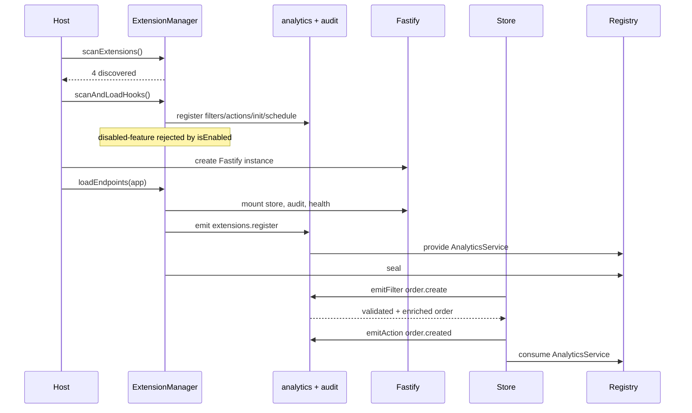

# Consumer app — executable feature lab

This is a small Fastify application that tests the published
`@codihaus/fastify-extensions@0.1.0` package as a real external consumer. It has no build
step and uses only plain ESM.

## Run the automated feature test

```bash
cd examples/consumer-app
npm install
npm test
```

The test boots the real app in memory with Fastify `inject()`. It verifies discovery versus
host enablement, required extensions, one context creation per extension, the two-phase
lifecycle, filter failure propagation, fire-and-forget actions, service sharing, bundle
routes, wildcard events, disabled routes, schedule cleanup, and manager reset.

## Run the server

```bash
npm start
# listening at http://127.0.0.1:3100
```

Try the full flow:

```bash
curl localhost:3100/
curl localhost:3100/store/products

curl -X POST localhost:3100/store/orders \
  -H 'content-type: application/json' \
  -d '{"product":"p1","amount":9.99}'

curl -X POST localhost:3100/store/orders \
  -H 'content-type: application/json' \
  -d '{"amount":-5}'

curl localhost:3100/store/analytics
curl localhost:3100/audit/log
curl localhost:3100/health
curl localhost:3100/disabled-feature/status
```

The last request returns `404`: `disabled-feature` is discovered from disk, but the host's
`isEnabled` policy prevents it from being imported or mounted.

## What each extension demonstrates

| Extension | Shape | Capabilities |
|---|---|---|
| `analytics` | Default hook export | Sequential filter, init provider, async action, cron schedule |
| `store` | Default endpoint export | Scoped Fastify routes, event emission, service consumption |
| `audit` | Bundle | Named hooks, multiple endpoint prefixes, wildcard action |
| `disabled-feature` | Default endpoint export | Discovery without loading through host enablement policy |

The host also marks `analytics`, `audit`, and `store` as `mustLoad`. Boot fails immediately
if any required extension cannot be discovered and registered.

## Boot and request flow



## Host structure

- `app.mjs` builds the application without opening a port, so production boot and tests use
  exactly the same lifecycle.
- `server.mjs` is only the network entry point and graceful shutdown handler.
- `test.mjs` is a zero-framework smoke test using Node assertions and Fastify injection.
- `contracts.mjs` contains the shared typed service reference used by the provider and
  consumer without coupling their implementations.

Extension-author helpers are imported from `@codihaus/fastify-extensions/types`; the host
manager is imported from the package root. That separation keeps extension code on the
zero-runtime authoring surface.
